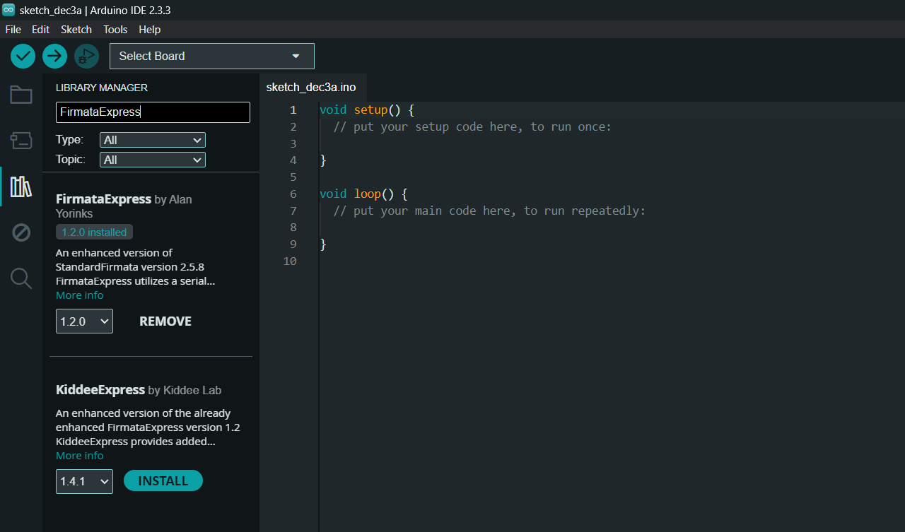
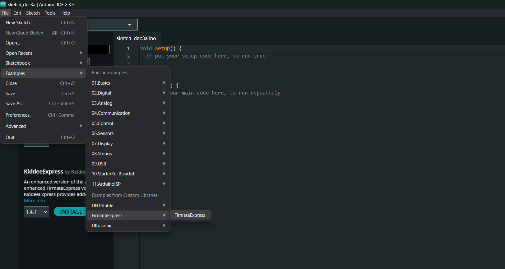

# Web App Installation Guide

## Prerequisites
- Python 3.12
- pip

## Installation Scripts
- **Windows**: Use `scripts/loopy_install_windows.ps1` for automated installation
  ```powershell
  .\scripts\loopy_install_windows.ps1
  ```
- **Linux/macOS**: Use `scripts/loopy_install.sh` for automated installation
  ```bash
  chmod +x scripts/loopy_install.sh
  ./scripts/loopy_install.sh
  ```

## Part 1: FirmataExpress Installation

### Arduino IDE Installation
1. Go to [Arduino download page](https://www.arduino.cc/en/Main/Software)
2. Select distribution for your operating system

### Install FirmataExpress
1. Open Arduino IDE
2. Select Tools/Manage Libraries
3. Search for *FirmataExpress*
4. Click install




### Install Ultrasonic Library
1. Go to Tools/Manage Libraries
2. Search for "ultrasonic"
3. Find version by Erick Simoes
4. Click Install

### Prepare Arduino
1. Verify board type in Tools menu
2. Confirm correct communication port
3. open firmata code in examples by file -> examples -> firmata -> firmata

4. Code is loaded in Ardino IDE
3. Compile and upload FirmataExpress
## Part 2: Usage Guide

### Preparation Steps

**Step 1: Sensor and Actuator Connection**
- Disconnect power from microcontroller
- Attach sensors and actuators
- **Warning:** Never add/remove sensors with power applied

**Step 2: Power Up Microcontroller**
- Apply power to microcontroller

**Step 3: Start Server**
- **Windows**: Use `scripts/loopy_install_windows.ps1` for automated server startup
  ```powershell
  .\scripts\looply_install_windows.ps1
  ```
- **Linux/macOS**: Use `scripts/loopy_install.sh` for automated server startup
  ```bash
  chmod +x scripts/loopy_install.sh
  ./scripts/looply_install.sh
  ```
  
## Important Cautions
- Always properly terminate the server
- Failure to close correctly may cause startup issues on next attempt
- If server fails, reboot computer and reinstall

## Troubleshooting
- Refer to installation scripts in `scripts/` directory
- Ensure all dependencies are correctly installed
### Arduino IDE Installation